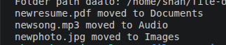

#file Organizer Project

A Simple Python project that automatically organizes files into folders.
##features
1. Moves image to Image folder
2. Moves videos to Video folder
3. Moves documents to Document folder
4. Moves audio to Audio folder

##Technologies Used
1. Python 
2. Linux
3. Git
4. Github

##How to run

Run the following commands:
on bash
python3 organizer.py

Then enter the folder path you want to organize.

Example
Before:
photo.jpg
movie.mp4
resime.pdf

After:
Images/
Videos/
Documents/

##Screenshots

##project run output

